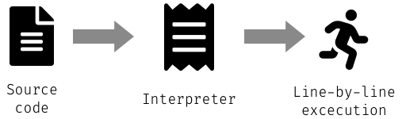

<!--
TODO: move this file to the corresponding meetup folder
-->
# Python meetup presentation

## About me

- working with Python for ~11 years (mostly Numpy, Matplotlib, Cython, ...)
- "European polygot"
- PhD student in Physics at Instituto Superior Tecnico (IST)
- working on numerical simulations of plasmas
- numerical simulations are based on Fortran and run on up to 2M CPUs and
also GPUs

---

## Disclaimer

- The things discussed in this meetup are not presenting anything related with
my research, my PhD or my day-to-day working schedule.
- This presentation is build up based on three major questions which
"hopefully" are up to now unanswered for your.
- Each section will try to cover a little bit of content connected with this
question and will give some insight to educate and enlighten the audience.
- After the presentation you should basically have a deeper understanding
about Python as a programming language and hopefully it will provide you with
some insights for future steps you are trying to achieve with Python.

---

# Should you use Python 2 or Python 3?

<!--

- **RAISE A HAND WHO IS WORKING WITH PYTHON 2.x**
- **RAISE A HAND WHO IS WORKING WITH PYTHON 3.x**

-->

---

# Use Python 3

---

# Python 2.7 will not be maintained past 2020


---

# Pro's for using Python 3

- Advanced unpacking:

  ```python
  a, b, *rest = range(100)    # a = 0, b = 1, rest = [..]
  a, *rest, b = range(100)    # a = 0, b = 99, rest = [..]
  ```

- Chained exceptions (in Python 2 you lost the traceback on the go):

  ```python
  def mycopy(source, dest):
      try:
          shutil.copy2(source, dest)
      except OSError: # We don't have permissions. More on this later
          raise NotImplementedError("automatic sudo injection")
  ```

- More exceptions especially for `OSError`
- Almost everything is an iterator
  - speeds up code parts and reduces memory footprint
  - use `list()` to get a list out of an iterator
- No more comparision of everything to everything

  ```python
  "abc" > 123
  # Python 2: True
  # Python 3: TypeError: '>' not supported between instances of 'str' and 'int'
  ```

- caching of function calls `functools.lru_cache`
- Matrix multiplication with `@` operator
- `pathlib` in standard library for dealing with paths

> courtesy to [Aaron Meurer's presentation "10 awesome features of Python that you can't use because you refuse to upgrade to Python 3"](https://www.asmeurer.com/python3-presentation/slides.html)

- Since Python 3.6, Python runs faster and is more economical with memory
- f-Strings: `print(f"some variable = {variable}")`
- asyncio: writing concurrent code
- type annotations

---

# Why use Python 2

- some library are **STILL** not compatible with Python 3

---

# Python packaging and tools

## Python package management

- **Pip:** pip is the package installer for Python
- **Pipenv:** is a tool that aims to bring the best of all packaging worlds
- **Poetry:** helps to declare, manage and install dependencies of Python
  projects, ensuring you have the right stack everywhere

## How about working with different python versions

- **Conda:** package, dependency and environment management for any
  language—Python, R, Ruby, Lua, Scala, Java, JavaScript, C/ C++, FORTRAN
- **Docker:** containerization for managing "dependency hell"

---

# Solving python version issues with Conda

- CLI tool which is used as a package management system and environment
  management system
- Cross-platform
- Pip on steroids (simplified)
- To install `conda`, either install
  [Anaconda](https://www.anaconda.com/distribution/) or
  [Miniconda](https://docs.conda.io/en/latest/miniconda.html)

---

# Creating custom environment

- Like a `virtualenvwrapper` a separate "hidden" environment not to interact
  with your system python
- Resolves automatically dependencies and installs recipes and pre-build
  packages

  ```sh
  conda create -n new_conda_environment python=2.6 django=1.6
  ```

---

# Activating custom conda environment

Listening all available `conda` environments:

```sh
conda info --envs
```

Output:

```log
#conda environments:
base                   *  /Users/anton/miniconda3
new_conda_environment     /Users/anton/miniconda3/envs/new_conda_environment
```

---

# Activating an environment is easy as

```sh
conda activate new_conda_environment
# will add `(<enviroment_name>)` in front of the prompt in the shell
```

Each environment `pip` comes with an own `pip`

```sh
which pip
```

```log
/Users/anton/miniconda3/envs/new_conda_environment/bin/pip
```

Including the specified packages and version

```sh
pip list
```

```log
Django (1.6.6)
pip (7.1.0)
setuptools (18.0.1)
```

---

# Better to install new packages through `conda install` if available rather than `pip`

---

# Is Python a compiled or interpreted programming language?

---

# Compiled language


---

# Interpreted language



---

# Is Python an interpreted or compiled programming language?

<!--
- **RAISE A HAND IF YOU THINK IT'S COMPILED**
- **RAISE A HAND IF YOU THINK IT'S INTERPRETED**
- **RAISE A HAND IF YOU THINK IT'S BOTH**
-->

---

# It's both

---

# Python compiles source file to bytecode and executes it


---

# Demo time

Jupyter Lab extension for bytecode by **Jeremy Tuloup**
 **jtpio**
 **@jtpio**

---

# Is Python slow?

---

# It depends!

---

# Let's find unique values in array

- create graphic of two arrays

---

# Python can beat C in performance


---

# Looking at the byte code

---

# Python is slow because of it's dynamic nature

Check out the Medium post [Why is Python so slow?](https://hackernoon.com/why-is-python-so-slow-e5074b6fe55b) by Anthony Shaw

---

# How can it beat still C?

```c
int main()
{
  // ...
  init_array(arr1, arr2, array_len, &count);

  shuffle_array(arr1, array_len);
  shuffle_array(arr2, array_len);

  tic = clock();
  check = count_common_entries(arr1, arr2, array_len);
  toc = clock();
  // ...
}

int count_common_entries(*arr1, *arr2, N)
{
  // ..
  int count = 0;
  for (int i = 0; i < N; i++){
    for (int j = 0; j < N; j++){
      if (arr1[i] == arr2[j]){
        count += 1;
        break;
      }
    }
  }
  // ..
}
```

```python
def find_tags(arr_length):
    arr1, arr2, count = init_arrays(arr_length)

    shuffle(arr1)
    shuffle(arr2)

    tic = time()
    check = count_common_entries(arr1, arr2)
    toc = time()
```

```python
def count_common_entries(arr1, arr2):
    # generate set from arr1
    tags = set(arr1)

    # check common entries
    common = 0
    for val in arr2:
        if val in tags:
            common += 1

    return common
```

---

# Good resources

- [Talk Python To Me](https://talkpython.fm/) by Michael Kennedy **(@mkennedy)**
- [Python Bytes](https://pythonbytes.fm/) by Michael Kennedy **(@mkennedy)** and
  Brian Okken **(@brianokken)**
- [Real Python](https://realpython.com/) has awesome tutorials for different levels of expertise

---

# Thank you