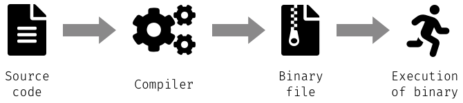

---

# Is Python a compiled or interpreted programming language

---

# Compiled language

---

# Interpreted language

---

# Is Python an interpreted or compiled programming language

<!--
- **RAISE A HAND IF YOU THINK IT'S COMPILED**
- **RAISE A HAND IF YOU THINK IT'S INTERPRETED**
- **RAISE A HAND IF YOU THINK IT'S BOTH**
-->

---

# It's both

---

# Python compiles source file to bytecode and executes it

---

# Demo time

## Jupyter Lab extension for bytecode by **Jeremy Tuloup**

d
<!--
 **jtpio**
 **@jtpio**

-->