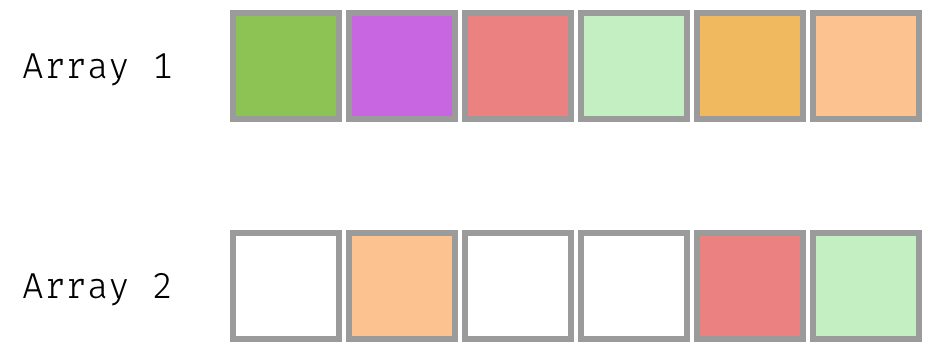
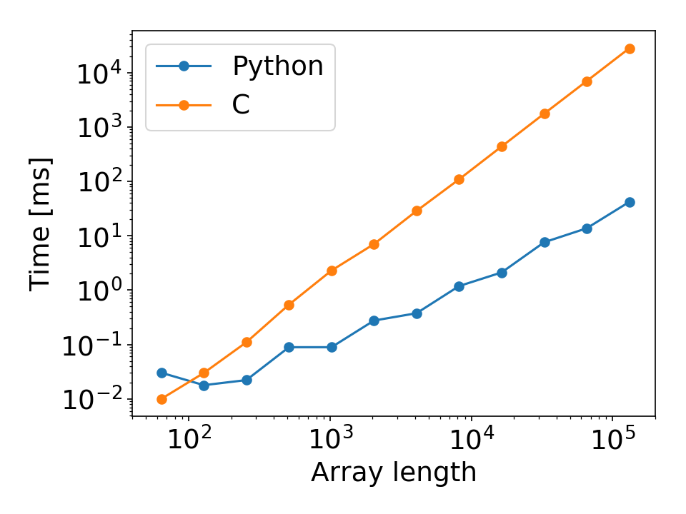

---

# Is Python slow?

---

# It depends

---

# Let's find unique values in array



---

# Python can beat C in performance



---

# Looking at the byte code

---

# Python is slow because of it's dynamic nature

##

Check out the Medium post [Why is Python so slow?](https://hackernoon.com/why-is-python-so-slow-e5074b6fe55b) by Anthony Shaw

---

# How can it beat still C?

```c
int main()
{
  // ...
  init_array(arr1, arr2, array_len, &count);

  shuffle_array(arr1, array_len);
  shuffle_array(arr2, array_len);

  tic = clock();
  check = count_common_entries(arr1, arr2, array_len);
  toc = clock();
  // ...
}

int count_common_entries(*arr1, *arr2, N)
{
  // ..
  int count = 0;
  for (int i = 0; i < N; i++){
    for (int j = 0; j < N; j++){
      if (arr1[i] == arr2[j]){
        count += 1;
        break;
      }
    }
  }
  // ..
}
```

```python
def find_tags(arr_length):
    arr1, arr2, count = init_arrays(arr_length)

    shuffle(arr1)
    shuffle(arr2)

    tic = time()
    check = count_common_entries(arr1, arr2)
    toc = time()
```

```python
def count_common_entries(arr1, arr2):
    # generate set from arr1
    tags = set(arr1)

    # check common entries
    common = 0
    for val in arr2:
        if val in tags:
            common += 1

    return common
```

---

# Compile directly Python to C

## Speeds up parts of the code by compilation

- [Mypyc](https://github.com/mypyc/mypyc): a compiler that compiles
  mypy-annotated, statically typed Python modules into Python C extensions
- [Nuitka](http://nuitka.net/pages/overview.html#): Python compiler written in
  Python